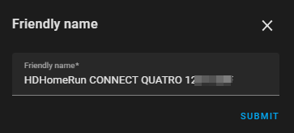
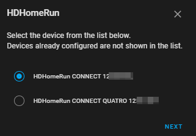
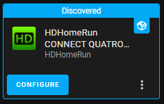
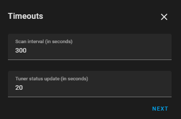

# HDHomeRun

Home Assistant integration for the Silicondust HDHomeRun network tuners.

## Description

This integration can be used to get basic information on each HDHomeRun
device in the network. The integration can use the UDP broadcast discovery
protocol, the TCP control protocol and the HTTP API.

### Entities Provided

Where applicable the sub-items in the list detail the additional attributes
available. All entities may not be available to you depending on how the
device was discovered and what its capabilities are.

#### Binary Sensors

* Channel Scanning - denotes whether a channel scan is in progress
  * Percentage progress
* Update available - denotes whether there is a firmware update available
  for the device _(only if using a HASS version below 2022.4)_

#### Button

* Channel Scan - instructs the device to carry out a channel scan using the
  selected source
* Restart - allows restarting a device

#### Select

* Channel Sources - allows selecting the channel source to be used when carrying
  out a channel scan

#### Sensors

* Channel Count - the number of channels currently tuned on the device
* Disabled Channels - the number of channels marked as disabled in the channel
list
  * List of channel names
* Favourite Channels - the number of channels marked as favorites in the channel
list
  * List of channel names
* Newest Version - the latest version of firmware available for the device
  _(only if using a HASS version below 2022.4)_
* Tuner Count - the number of tuners the device has
* Tuner X - where X is the tuner number (states can be: `Idle`, `In use`,
  `Scanning` or the channel being watched, using the specified format)
  * Virtual channel number, virtual channel name, frequency, signal strength,
    signal quality, symbol quality, network rate and target IP (as applicable)
* Version - the current firmware version of the device _(only if using a
  HASS version below 2022.4)_

#### Update

* Update - used to show if a firmware update is required _(only if using a HASS
  version later than 2022.4)_

## Setup

### <a id="ManualAdd"></a>`Add Integration` button

If adding the integration by clicking the `Add Integration` button the
following information will be requested.


* `Host`: The IP of an HDHomeRun device on the network. Leave
  blank to carry out discovery.

  * If you provide a valid IP address, and you will be prompted for
    a friendly name.

    

### HTTP/UDP Discovery

This section is only applicable if you did not provide a host in the
[Add Integration](#ManualAdd) section.



Click `NEXT` and you will be prompted for a friendly name.


### Setup Complete

On successful set up the following screen will be seen detailing the device.


## SSDP Discovery

The integration can also detect the HDHomeRun devices on the network using
SSDP. When found they will look like this on your devices screen.



Clicking `CONFIGURE` you will be prompted for a friendly name.


## Configurable Options

It is possible to configure the following options for the integration.

### Timeouts



* `Scan Interval`: the frequency of updates for the sensors, default `300s`
* `Tuner status update`: the frequency of updates for tuners, default `10s`

### Options


* `Channel logo path` - the path to a directory containing channel logos,
  e.g. `/local/channel_logos`. The default is to have no logo. If previously
  set, you can clear this option by just entering a space

You can also select which format should be used for the sensor. The
default is `Channel name`.

_This setting is only effective when a tuner is actively tuned to a channel._

## Troubleshooting

### Debug Logging

Debug logging can be enabled in Home Assistant using the [`logger`
integration](https://www.home-assistant.io/integrations/logger/).

```yaml
logger:
  default: warning
  logs:
    custom_components.hdhomerun: debug
```

### Diagnostics Integration

Starting with Home Assistant 2022.2, a new diagnostics integration can be
used to provide troubleshooting for integrations.

The highlighted area in the image below shows where the link for downloading
diagnostics can be found.


An [example output](examples/diagnostics_output.json) can be found in this repo.
